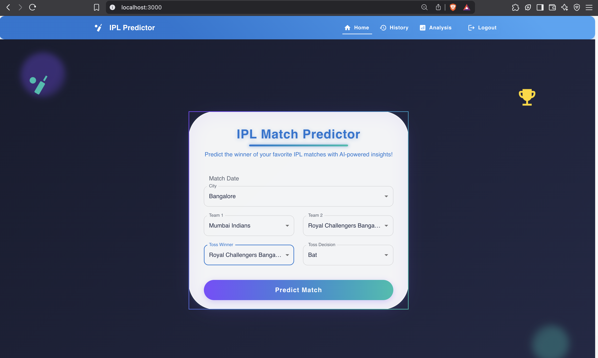
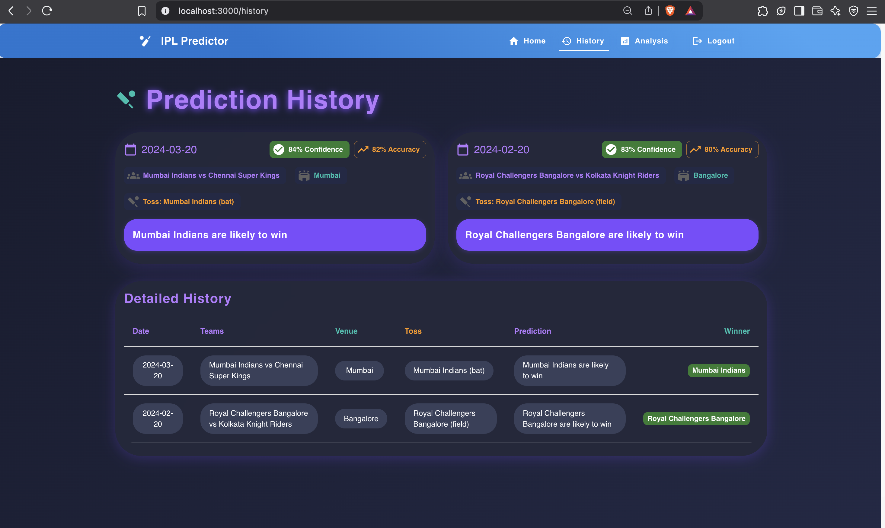
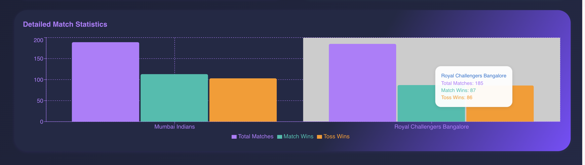

# 🏏 IPL Toss-to-Win Predictor

A full-stack, data-driven IPL match prediction platform.

> **Showcasing advanced data analysis, machine learning, and modern web development skills.**

---

## 🚀 Why You Should Be Excited

This project is more than just a sports app—it's a demonstration of my ability to:

- **Analyze Real-World Data:**  
  Cleaned, engineered, and visualized IPL match data to extract actionable insights.  
  Built custom metrics and interactive charts to help users (and stakeholders) understand the "why" behind predictions.

- **Build and Deploy Machine Learning Models:**  
  Designed and trained a Random Forest model to predict match outcomes using toss, team, and venue features.  
  Evaluated model performance with confusion matrices, feature importance, and conversion rates.  
  Integrated the model into a live API for real-time predictions.

- **Engineer Full-Stack Solutions:**  
  Developed a secure, responsive React frontend with glassmorphic, GenZ-inspired UI.  
  Built a robust Flask backend API, with JWT authentication and Dockerized deployment.  
  Seamlessly integrated ML predictions into a real-time, user-friendly web experience.

---

## 💡 What Sets This Project Apart

- **End-to-End Ownership:**  
  I handled everything—from data wrangling and model training, to API design, to frontend UX and deployment.

- **Modern, Aesthetic UI:**  
  The app isn't just functional—it's beautiful, immersive, and designed for today's users.

- **Explainable AI:**  
  Users don't just get a prediction—they get context, confidence, and visual analytics.

- **Production-Ready:**  
  Dockerized, modular, and ready for cloud deployment.

---

## 🛠️ Tech Stack

- **Frontend:** React.js, Material-UI, Chart.js, Axios  
- **Backend:** Python, Flask, scikit-learn, Pandas  
- **ML:** Random Forest Classifier, feature engineering, model evaluation  
- **DevOps:** Docker, REST API, JWT Auth

---

## 📊 Screenshots

### 1. Login Page

*Secure and user-friendly login interface for accessing the IPL Toss-to-Win Predictor.*

### 2. Home Page

*Welcome to the home page, where users can navigate through the application and access various features.*

### 3. Prediction History

*View past predictions and their outcomes, providing insights into user interactions and match results.*

### 4. Analysis Page 1

*Detailed analysis of team performance and match statistics, helping users make informed decisions.*

### 5. Analysis Page 2

*Interactive charts and visualizations to explore team dynamics and historical data.*

### 6. Analysis Page 3

*Comprehensive insights into match outcomes and team strategies, enhancing the user experience.*

---
## 🛠️ Skills

- **Full-Stack Development:** React, Flask, SQLAlchemy
- **Data Analysis:** Pandas, NumPy, Data Visualization
- **Machine Learning:** Scikit-learn, Model Evaluation, Feature Engineering
- **DevOps:** Docker, RESTful APIs, JWT Authentication

## 🤝 Let's Connect!

Looking for a data-driven, full stack developer who can own the entire product lifecycle?  
Let's talk!

---

## 🙋‍♂️ Contributing

Pull requests are welcome! For major changes, please open an issue first to discuss what you would like to change.

