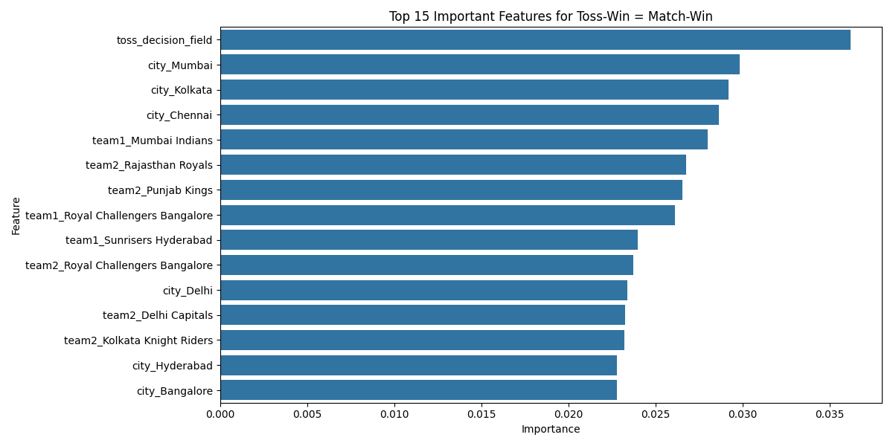
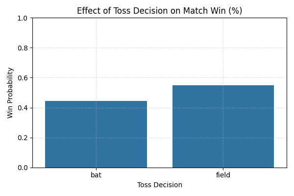

# 🏏 IPL Toss-to-Win Predictor 

A machine learning-powered web application that predicts the probability of an IPL team winning a match based on the toss outcome.

---

## 🚀 Project Overview

This app lets users explore how toss outcomes impact IPL match results. Select two teams, the toss winner, toss decision (bat/field), and the city—the app returns a data-driven probability of the toss winner also winning the match.

---

## 🛠️ Tech Stack

- ⚛️ **Frontend:** React.js, Tailwind CSS  
- 🐍 **Backend:** Flask, scikit-learn, Pandas  
- 📊 **Model:** Random Forest Classifier with GridSearchCV  
- 💾 **Model Storage:** Joblib  
- 🧪 **Development Mode:** Localhost
- 

  ## 🖥️ Frontend (React + Tailwind)

- Built using Create React App and Tailwind CSS
- Features intuitive dropdowns and validation
- Shows toss-to-win prediction result in real-time
- Fully responsive and styled with Tailwind
- Connects to Flask backend using Axios

📊 Model Evaluation Visuals

1. 🎯 Confusion Matrix
  

2. 🔍 Feature Importance

3. 📈 Team-wise Toss to Win Conversion Rate

 4.🧠 Toss Decision Impact

