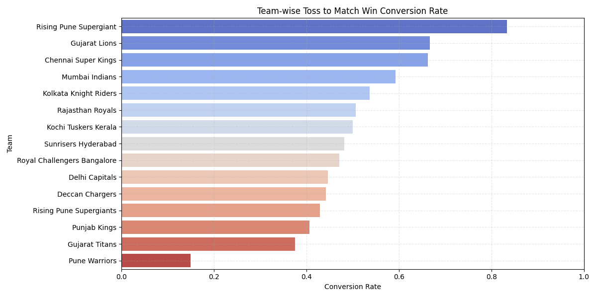

# IPL Toss to Win Predictor Backend

**A Flask-based REST API serving machine learning predictions for IPL matches.**  
Highlights my skills in data engineering, ML modeling, and API development.

---

## ✨ Why This Backend is Impressive

- **Data Engineering:**  
  - Cleaned and processed IPL match data for robust model training.
- **Machine Learning:**  
  - Trained a Random Forest Classifier with feature engineering and model evaluation.
  - Saved and loaded models with pickle for fast predictions.
- **API Development:**  
  - RESTful endpoints for predictions, with JWT authentication.
  - Dockerized for easy deployment.

---

## 🛠️ Tech Stack

- Python 3.x, Flask, scikit-learn, Pandas

---

## 🚀 Getting Started

```bash
python -m venv venv
source venv/bin/activate
pip install -r requirements.txt
python app.py
```
- Server runs at [http://localhost:5010](http://localhost:5010)

---

## 🧩 API Endpoints

### POST `/predict`
- **Body:**
  ```json
  {
    "team1": "string",
    "team2": "string",
    "toss_winner": "string",
    "toss_decision": "string",
    "city": "string"
  }
  ```
- **Response:**
  ```json
  {
    "result": "string",
    "confidence": 0.85
  }
  ```

---

## 📊 Data Science & ML Highlights

- **Feature Engineering:**  
  - Encoded teams, venues, and toss decisions for model input.
- **Model Evaluation:**  
  - Used confusion matrix, feature importance, and conversion rate charts.
- **Retraining:**  
  - Easily update the model with new data by running `ipl.py`.

---

## 🤝 Contributing

- Fork, branch, commit, and PR as usual!
- This backend is a showcase of my data analysis, ML, and API skills.

## Overview
This is the backend for the IPL Toss-to-Win Predictor application. It provides APIs for user authentication, match predictions, and analysis.

## Setup
1. Install dependencies:
   ```bash
   pip install -r requirements.txt
   ```

2. Configure the database:
   - Ensure PostgreSQL is running and accessible.
   - Update the `DATABASE_URL` in `app.py` if necessary.

3. Initialize the database:
   ```bash
   python init_db.py
   ```

4. Run the application:
   ```bash
   ./run.sh
   ```

## Default Test Account
For testing purposes, you can use the following account:

- **Username:** PRAVESH  
- **Password:** PRAVESH

This account is guaranteed to work every time.

## API Endpoints
- `/auth/register`: Register a new user.
- `/auth/login`: Login with existing credentials.
- `/auth/profile`: Get user profile (requires authentication).
- `/predict`: Get match predictions (requires authentication).
- `/analysis/stats`: Get analysis statistics.

## 📊 Data Visualization Techniques

### 1. 🎯 Confusion Matrix


### 2. 🔍 Feature Importance


### 3. 📈 Team-wise Toss to Win Conversion Rate


### 4. 🧠 Toss Decision Impact


## Contributing
Pull requests are welcome! For major changes, please open an issue first to discuss what you would like to change.
